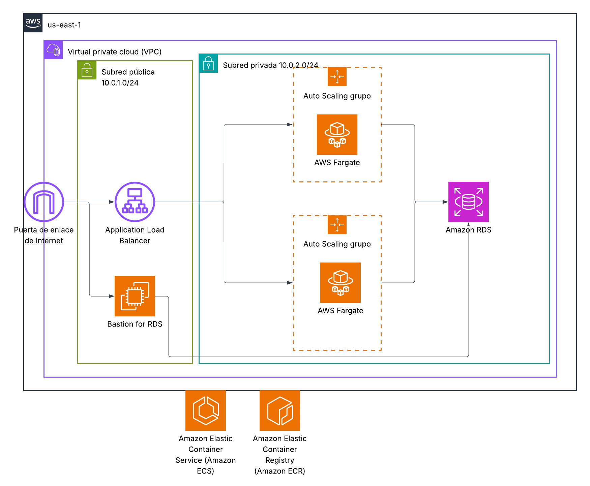

# Terraform Template using Fargate ECS containers and RDS Postgres

## Description
Terraform template using Fargate ECS and RDS Postgres containers to manage a serverless infrastructure that can grow according to the number of services required by the project.

## Requirements
- Terraform
- AWS CLI
- AWS Account
- Git
- Docker

## Infrastructure Deployment
- Clone the repository
- Make changes to the terraform.tfvars file as needed
- Run the terraform init command
- Run the terraform validate command
- Run the terraform plan command to see the changes
- Run the terraform apply command to create the resources

## Infrastructure Diagram

## Author and Project Information
- Author: Cristian Pineda
- Date: 2025-12-06
- Version: 1.0
- License: MIT